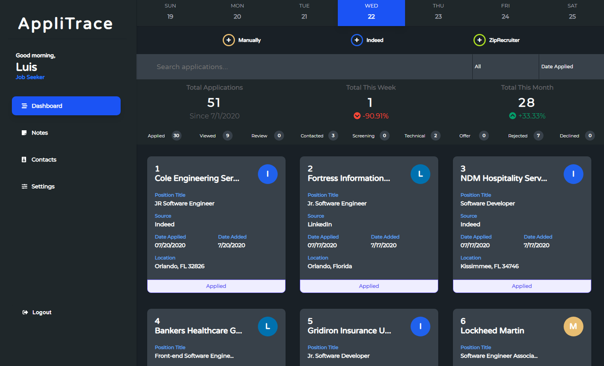
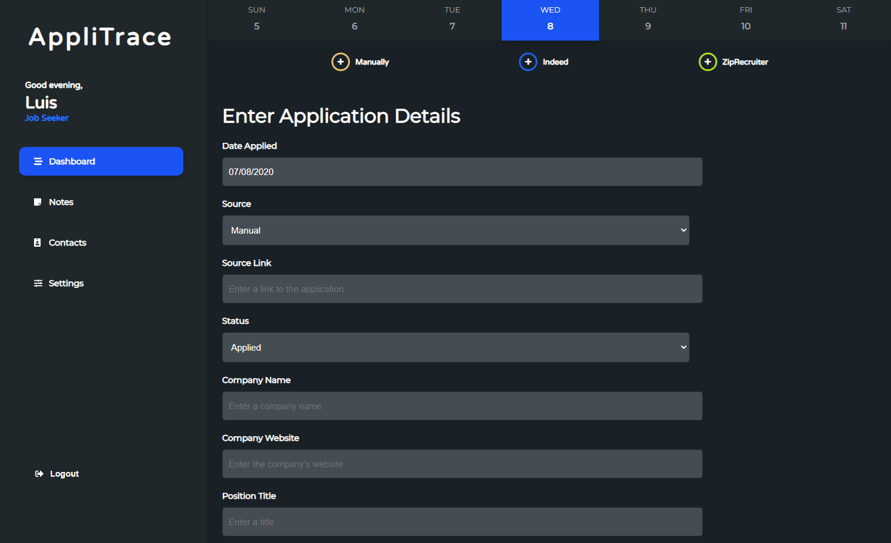
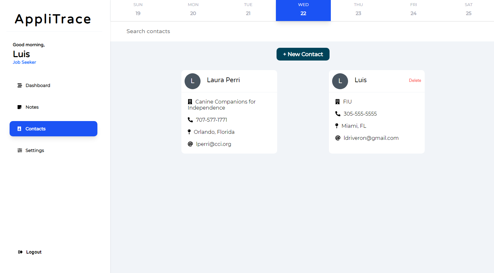

# AppliTrace
### By Luis Riveron

# Live At (DeployeD)
[https://applitrace.herokuapp.com](https://applitrace.herokuapp.com)

AppliTrace is a web application for tracking the status of work applications during the job search.

After creating an account, users can keep track of their job applications from various sources such as:
- Manually entering an application
- Indeed
- LinkedIn
- ZipRecruiter
- Snagajob

Each job application keeps track of:
- Date the user applied to the position
- Company name
- Position title
- Position location
- Application status
- Recruiter name
- Phone number
- Email address
- Salary expectation
- Description
- Benefits
- Notes

While on the Dashboard, users can search for applications by Position Title, Company Name, Status, and Location while at the same time deciding in what order the applications appear.
This searching feature updates the applications without ever refreshing the page by using axios.

Additionally, statistics indicators on the Dashboard show the user how their current week and month compares to their previous week and month in terms of positions applied for.

The Notes section compiles notes from applications and single notes entered by the user. A search bar makes navigating through the notes easier.

The Contacts section allows the user to save contacts with related information for future reference. A search bar makes finding a contact easier.

## Dashboard

## Dashboard Dark Theme

## Add Job Application Manually

## Add Job Application From Indeed

## Notes

## Contacts

## Settings

## Built With
- Javascript (Node.js, Express.js, React JS, axios)
- Passport.js for user authentication
- HTML5, CSS3, Sass
- MongoDB (Mongoose)