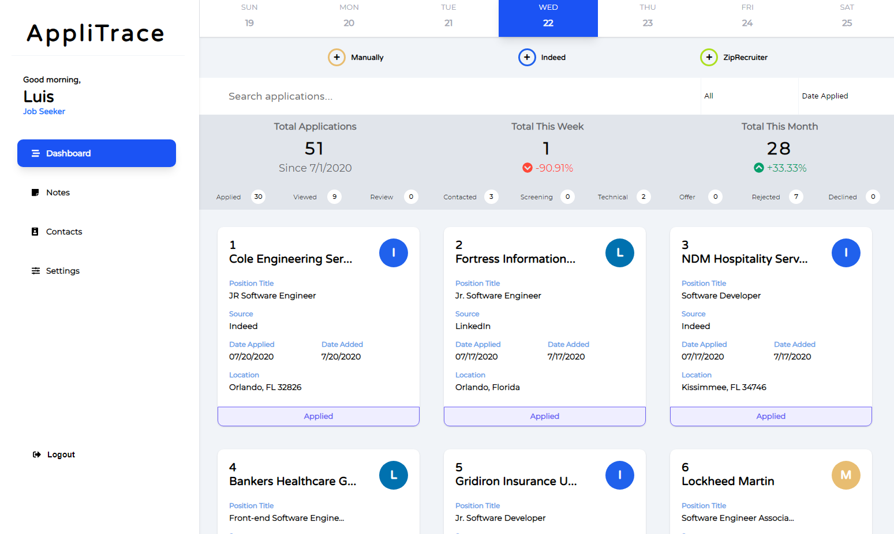
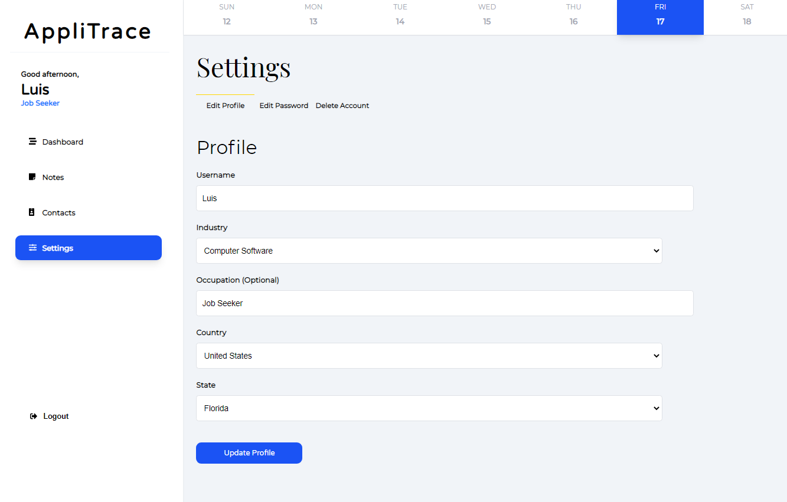

# AppliTrace
### By Luis Riveron

AppliTrace is a web application for tracking the status of work applications during the job search.

After creating an account, users can keep track of their job applications from various sources such as:
- Manually entering an application
- Indeed
- LinkedIn
- ZipRecruiter
- Snagajob

Each job application keeps track of:
- Date the user applied to the position
- Company name
- Position title
- Position location
- Application status
- Recruiter name
- Phone number
- Email address
- Salary expectation
- Description
- Benefits
- Notes

## Dashboard

## Dashboard Dark Theme

## Add Job Application Manually

## Add Job Application From Indeed

## Settings

## Built With
- Javascript (Node.js, Express.js, React JS)
- Passport.js for user authentication
- HTML5, CSS3, Sass
- MongoDB (Mongoose)